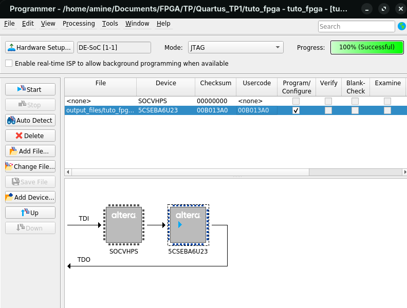
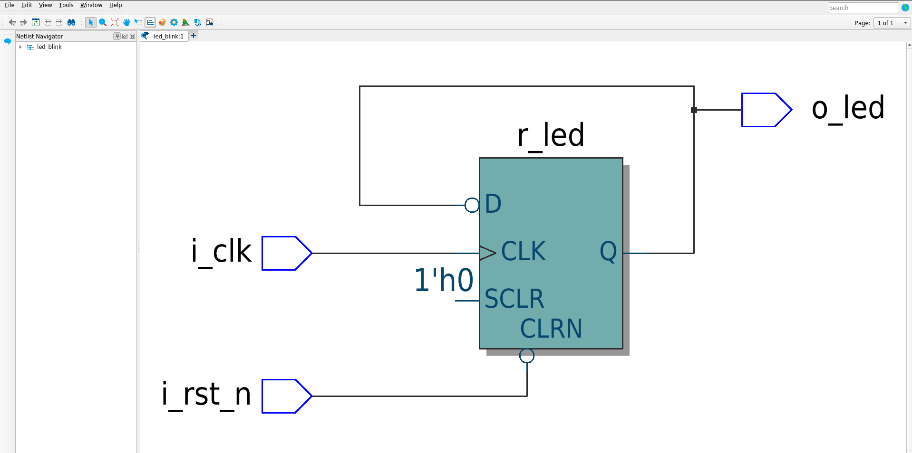
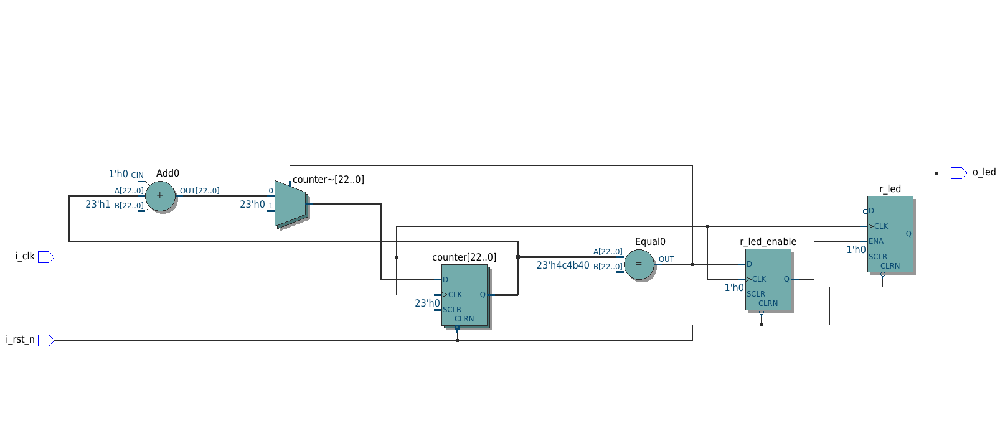
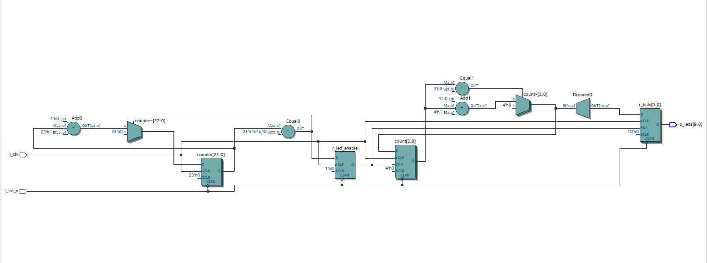

# TP1 FPGA — Tuto 

**Auteurs :** MEGDER Mohamed Al Amine — HAJJI Abdelmoughit  
**Carte :** DE10-Nano (Cyclone V `5CSEBA6U23I7`) — **Logiciel :** Quartus Prime Lite 25.1

---

## 1. Tutoriel Quartus

### Code

```vhdl
library ieee;
use ieee.std_logic_1164.all;

entity tuto_fpga is
    port (
        pushl : in  std_logic;
        led0  : out std_logic
    );
end entity tuto_fpga;

architecture rtl of tuto_fpga is
begin
    led0 <= not pushl;
end architecture rtl;
```

### Broches

| Signal | Élément | Broche |
|---|---|---|
| `pushl` | Bouton encodeur gauche | `PIN_AH27` |
| `led0` | LED0 | `PIN_AG28` |



### Questions

**Q9 — Ça fonctionne ?** Oui, mais le comportement est inversé : la LED est allumée au repos et s'éteint à l'appui.

**Q10 — Correction :** le bouton est câblé avec une résistance de pull-up, il vaut `'1'` au repos et `'0'` à l'appui. On inverse donc l'entrée : `led0 <= not pushl;`

| Bouton relâché | Bouton enfoncé |
|---|---|
|  |  |

---

## 2. Faire clignoter une LED

**Q1 — Horloge :** `FPGA_CLK1_50` (50 MHz) est sur la broche **`PIN_V11`**.

### Version sans diviseur (Q3, Q4)

Schéma : une bascule D `r_led` dont la sortie est rebouclée sur l'entrée via un inverseur, avec un reset asynchrone.




Le RTL Viewer correspond au schéma : on retrouve la bascule et l'inverseur rebouclé.

**Q5 — Pourquoi ne pas tester ?** La LED change d'état à chaque front d'horloge (période 40 ns, soit 25 MHz) : c'est invisible à l'œil.

### Version avec diviseur (Q6, Q7, Q8)

```vhdl
library ieee;
use ieee.std_logic_1164.all;

entity led_blink is
    port (
        i_clk   : in  std_logic;
        i_rst_n : in  std_logic;
        o_led   : out std_logic
    );
end entity led_blink;

architecture rtl of led_blink is
    signal r_led        : std_logic := '0';
    signal r_led_enable : std_logic := '0';
begin
    process(i_clk, i_rst_n)
        variable counter : natural range 0 to 5000000 := 0;
    begin
        if (i_rst_n = '0') then
            counter := 0;
            r_led_enable <= '0';
        elsif (rising_edge(i_clk)) then
            if (counter = 5000000) then
                counter := 0;
                r_led_enable <= '1';
            else
                counter := counter + 1;
                r_led_enable <= '0';
            end if;
        end if;
    end process;

    process(i_clk, i_rst_n)
    begin
        if (i_rst_n = '0') then
            r_led <= '0';
        elsif (rising_edge(i_clk)) then
            if (r_led_enable = '1') then
                r_led <= not r_led;
            end if;
        end if;
    end process;

    o_led <= r_led;
end architecture rtl;
```

Le compteur génère une impulsion toutes les 5 000 001 × 20 ns ≈ **100 ms**. La LED change d'état à chaque impulsion : elle clignote à environ **5 Hz**. Le compteur nécessite 23 bits.




Le RTL Viewer montre le compteur (additionneur, comparateur, registre) et la bascule `r_led` commandée par `r_led_enable`.

### Reset (Q9, Q10, Q11)

| Signal | Élément | Broche |
|---|---|---|
| `i_clk` | FPGA_CLK1_50 | `PIN_V11` |
| `i_rst_n` | KEY0 | `PIN_AH17` |
| `o_led` | LED0 | `PIN_AG28` |

**Q11 — Que signifie `_n` ?** Le signal est **actif à l'état bas** : le reset agit quand `i_rst_n = '0'`. Le bouton KEY0 est relié à une pull-up : il vaut `'1'` au repos et `'0'` à l'appui. Sur la carte, la LED reste éteinte tant que KEY0 est enfoncé.


---

## 3. Chenillard

Un diviseur de fréquence génère une impulsion toutes les 100 ms. À chaque impulsion, un registre circulaire de 10 bits décale la LED allumée d'une position.

```vhdl
library ieee;
use ieee.std_logic_1164.all;

entity chenillard is
    port (
        i_clk   : in  std_logic;
        i_rst_n : in  std_logic;
        o_leds   : out std_logic_vector(9 downto 0)
    );
end entity chenillard;

architecture rtl of chenillard is
    signal r_leds       : std_logic_vector(9 downto 0) := "0000000001";
    signal r_led_enable : std_logic := '0';
begin

    process(i_clk, i_rst_n)
        variable counter : natural range 0 to 5000000 := 0;
    begin
        if (i_rst_n = '0') then
            counter := 0;
            r_led_enable <= '0';

        elsif rising_edge(i_clk) then
            if counter = 5000000 then
                counter := 0;
                r_led_enable <= '1';
            else
                counter := counter + 1;
                r_led_enable <= '0';
            end if;
        end if;
    end process;


    process(i_clk, i_rst_n)
        variable count : natural range 0 to 9 := 0;
    begin
        if (i_rst_n = '0') then
            r_leds <= "0000000000";
            count := 0;

        elsif rising_edge(i_clk) then
            if r_led_enable = '1' then

                if count = 9 then
                    count := 0;
                else
                    count := count + 1;
                end if;

                r_leds <= (others => '0');
                r_leds(count) <= '1';

            end if;
        end if;
    end process;

    o_leds <= r_leds;

end architecture rtl;

```


| LED | 0 | 1 | 2 | 3 | 4 | 5 | 6 | 7 | 8 | 9 |
|---|---|---|---|---|---|---|---|---|---|---|
| Broche | AG28 | AE25 | AG26 | AG25 | AG23 | AH21 | AF22 | AG20 | AG18 | AG15 |




https://github.com/user-attachments/assets/97b0a7cb-cddf-4355-968b-e5da5ef7f2d7

