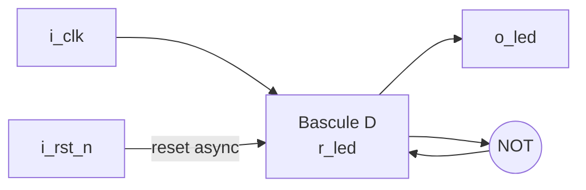
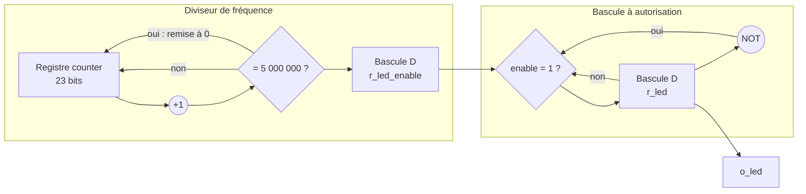
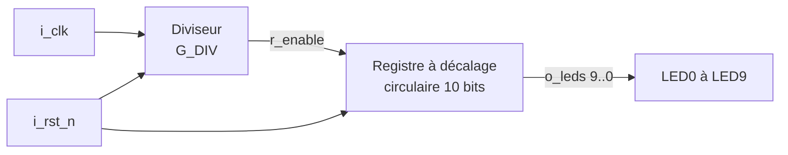

# TP FPGA — Prise en main de Quartus Prime

> **Auteurs :** [Nom Prénom] — [Nom Prénom du binôme]
> **Enseignant :** [Nom de l'enseignant]
> **Date :** [JJ/MM/AAAA]
> **Carte :** Terasic DE10-Nano — FPGA Intel Cyclone V SoC `5CSEBA6U23I7`
> **Logiciel :** Quartus Prime Lite 25.1 (sous Arch Linux)

## Sommaire

1. [Objectifs](#1-objectifs)
2. [Organisation du dépôt](#2-organisation-du-dépôt)
3. [Tutoriel Quartus : premier composant combinatoire](#3-tutoriel-quartus--premier-composant-combinatoire)
4. [Faire clignoter une LED](#4-faire-clignoter-une-led)
5. [Chenillard](#5-chenillard)
6. [Difficultés rencontrées](#6-difficultés-rencontrées)
7. [Conclusion](#7-conclusion)

---

## 1. Objectifs

- Maîtriser le flot de conception sous Quartus Prime : création de projet, saisie VHDL, synthèse, affectation des broches, compilation et programmation.
- Passer d'une logique **combinatoire** à une logique **séquentielle** synchrone, avec horloge et reset.
- Comparer les schémas attendus avec ceux inférés par l'outil (**RTL Viewer**).
- Concevoir en autonomie un **chenillard**.

## 2. Organisation du dépôt

```
.
├── README.md                 # Ce compte rendu
├── images/                   # Captures d'écran et photos
├── tuto_fpga/                # Premier composant combinatoire
│   └── tuto_fpga.vhd
├── led_blink/                # LED clignotante
│   ├── led_blink.vhd
│   └── led_blink.sdc         # Contrainte d'horloge
└── chenillard/               # Chenillard
    ├── chenillard.vhd
    └── tb_chenillard.vhd     # Testbench
```

---

## 3. Tutoriel Quartus : premier composant combinatoire

### 3.1 Branchement de la carte

La carte est alimentée par un **bloc secteur externe** : le courant fourni par l'USB est insuffisant. Elle est programmée uniquement par le port **USB BLASTER II**, situé du même côté que le connecteur d'alimentation et le port HDMI.


### 3.2 Création du projet

Le projet `tuto_fpga` est créé avec `File > New Project Wizard` (chemin sans espace ni caractère spécial, projet vide). Le composant cible est le **`5CSEBA6U23I7`** (ni la variante `L`, ni la variante `S`).

| Champ | Signification |
|---|---|
| `5CSE` | Cyclone V, variante SE (SoC : FPGA + processeur ARM, le HPS) |
| `A6` | Densité (environ 110 000 éléments logiques) |
| `U23` | Boîtier UBGA 672 billes |
| `I7` | Gamme de température industrielle, classe de vitesse 7 |


### 3.3 Code VHDL

Le composant recopie l'état du bouton de l'encodeur gauche sur la LED0. Le nom de l'`entity` doit être identique à celui du projet, car Quartus la considère comme l'entité de plus haut niveau (*top-level*).

```vhdl
entity tuto_fpga is
    port (
        pushl : in  std_logic;
        led0  : out std_logic
    );
end entity tuto_fpga;

architecture rtl of tuto_fpga is
begin
    led0 <= pushl;
end architecture rtl;
```

### 3.4 Fichier de contraintes

Quartus ne peut pas savoir à quelles broches sont reliés le bouton et la LED. Après une première **Analysis & Synthesis**, les broches sont affectées dans `Assignments > Pin Planner` :

| Signal | Direction | Élément | Broche FPGA |
|---|---|---|---|
| `pushl` | Entrée | Bouton de l'encodeur gauche (LEFT_PB) | `PIN_AH27` |
| `led0` | Sortie | LED0 | `PIN_AG28` |


### 3.5 Compilation et programmation

`Compile Design` enchaîne la synthèse, le placement-routage (*Fitter*), la génération du fichier `.sof` (*Assembler*) et l'analyse temporelle.

Dans le Programmer : `Hardware Setup` > **DE-SoC**, puis `Auto Detect`. La chaîne JTAG contient deux puces, le HPS (`SOCVHPS`) et le FPGA (`5CSEBA6`). Le fichier `output_files/tuto_fpga.sof` est affecté au FPGA, la case `Program/Configure` est cochée, puis on clique sur `Start`.

> Le `.sof` configure la SRAM interne du FPGA, qui est volatile : la configuration est perdue à la mise hors tension.


### 3.6 Ça fonctionne ? (question 9)

Oui, mais le comportement est **inversé** : la LED est allumée au repos et s'éteint quand on appuie sur le bouton.


### 3.7 Correction du comportement (question 10)

**Explication :** le bouton est câblé avec une résistance de tirage (*pull-up*). Il délivre `'1'` au repos et `'0'` lorsqu'il est enfoncé : il est **actif à l'état bas**. Comme `led0` recopie `pushl`, la LED est allumée au repos.

**Correction :** on inverse l'entrée.

```vhdl
led0 <= not pushl;
```

Après recompilation et reprogrammation, la LED s'allume uniquement lors de l'appui. Code complet : [`tuto_fpga/tuto_fpga.vhd`](tuto_fpga/tuto_fpga.vhd).

| Bouton relâché | Bouton enfoncé |
|---|---|
|  |  |

---

## 4. Faire clignoter une LED

### 4.1 Horloge de la carte (question 1)

D'après le manuel utilisateur de la DE10-Nano, l'horloge **FPGA_CLK1_50** (50 MHz, période 20 ns) est connectée à la broche **`PIN_V11`**.

### 4.2 Schéma du composant `led_blink` (questions 2 et 3)

Le processus est sensible à `i_clk` et `i_rst_n` : c'est un registre à **reset asynchrone**. Le schéma comporte :

- une **bascule D** (`r_led`) déclenchée sur front montant de `i_clk` ;
- un **inverseur** rebouclant sa sortie sur son entrée (`r_led <= not r_led`) ;
- une **remise à zéro asynchrone** active à l'état bas (`i_rst_n`) ;
- la sortie `o_led` reliée à la sortie de la bascule.

C'est une **bascule T** dont l'entrée est maintenue à 1.




### 4.3 Comparaison avec le RTL Viewer (question 4)


On retrouve le registre `r_led` et l'inverseur rebouclé. Quartus ajoute en général un inverseur sur le reset, car sa primitive de bascule a une entrée de remise à zéro asynchrone active à l'état haut. [À compléter selon votre capture.]

### 4.4 Pourquoi ne pas tester ce code ? (question 5)

`r_led` change d'état à chaque front montant, donc sa période vaut deux périodes d'horloge :

$$T_{LED} = 2 \times T_{clk} = 2 \times 20\ \text{ns} = 40\ \text{ns} \Rightarrow f_{LED} = 25\ \text{MHz}$$

C'est bien trop rapide pour l'œil : la LED semblerait allumée en permanence, à intensité réduite.

### 4.5 Réduction de la fréquence (question 6)

On ajoute un **diviseur de fréquence** : un compteur de 0 à 5 000 000 génère une impulsion `r_led_enable` d'un cycle, et `r_led` ne bascule que lorsque cette impulsion vaut `'1'`. Code complet : [`led_blink/led_blink.vhd`](led_blink/led_blink.vhd).

$$T_{enable} = 5\,000\,001 \times 20\ \text{ns} \approx 100\ \text{ms} \qquad T_{LED} = 2 \times T_{enable} \approx 200\ \text{ms} \Rightarrow f_{LED} \approx 5\ \text{Hz}$$

**Taille du compteur :** $2^{22} = 4\,194\,304 < 5\,000\,000 < 2^{23} = 8\,388\,608$, donc **23 bits**. La contrainte `natural range 0 to 5000000` permet à la synthèse de le déterminer ; sans elle, un entier 32 bits serait inféré.

Bien que `counter` soit une **variable**, il est synthétisé en registre : sa valeur est lue avant d'être mise à jour, elle doit donc être mémorisée d'un front à l'autre.

### 4.6 Schéma du nouveau code (question 7)




### 4.7 Vérification avec le RTL Viewer (question 8)


[À compléter : repérer le registre de comptage, l'additionneur, le comparateur, les multiplexeurs et les deux bascules.]

### 4.8 Conventions de nommage

| Préfixe | Nature | Exemple |
|---|---|---|
| `i_` | Entrée | `i_clk`, `i_rst_n` |
| `o_` | Sortie | `o_led` |
| `r_` | Registre | `r_led`, `r_led_enable` |
| `s_` | Signal interne | — |

### 4.9 Signal de reset (questions 9 et 10)

Chaque registre possède un reset, qui garantit un état initial connu. Le reset `i_rst_n` est relié au bouton **KEY0** (`PIN_AH17`).

| Signal | Élément | Broche FPGA |
|---|---|---|
| `i_clk` | FPGA_CLK1_50 | `PIN_V11` |
| `i_rst_n` | KEY0 | `PIN_AH17` |
| `o_led` | LED0 | `PIN_AG28` |


### 4.10 Signification de `_n` (question 11)

Le suffixe `_n` signifie que le signal est **actif à l'état bas** : le reset est effectif lorsque `i_rst_n = '0'`.

**Pourquoi ?** Les boutons KEY de la DE10-Nano sont reliés à une résistance de tirage : ils délivrent `'1'` au repos et `'0'` lorsqu'ils sont enfoncés. Le reset est donc actif tant qu'on appuie sur KEY0. Indiquer la polarité dans le nom du signal évite les erreurs lors de l'interconnexion des composants.

**Résultat sur la carte :** la LED clignote à environ 5 Hz, et reste éteinte tant que KEY0 est maintenu enfoncé.


### 4.11 Contrainte d'horloge (bonus)

Le fichier [`led_blink/led_blink.sdc`](led_blink/led_blink.sdc) déclare l'horloge à 50 MHz, ce qui supprime le warning d'horloge non contrainte et permet au Timing Analyzer de vérifier les délais :

```tcl
create_clock -name clk50 -period 20.000 [get_ports {i_clk}]
```

---

## 5. Chenillard

### 5.1 Cahier des charges

Allumer successivement les 10 LED de la carte mezzanine, une seule à la fois, à une vitesse visible. KEY0 réinitialise le système.

### 5.2 Architecture

- Un **diviseur de fréquence**, identique à celui de la partie 4, produit une impulsion `r_enable` toutes les ~100 ms.
- Un **registre à décalage circulaire** de 10 bits, `r_leds`, initialisé à `"0000000001"` au reset, décale son contenu à chaque impulsion : `r_leds <= r_leds(8 downto 0) & r_leds(9);`

Les `generic` `G_DIV` et `G_N` rendent le composant paramétrable et permettent une simulation rapide.




Code complet : [`chenillard/chenillard.vhd`](chenillard/chenillard.vhd).

### 5.3 Affectation des broches

| Signal | Élément | Broche FPGA |
|---|---|---|
| `i_clk` | FPGA_CLK1_50 | `PIN_V11` |
| `i_rst_n` | KEY0 | `PIN_AH17` |
| `o_leds[0]` | LED0 | `PIN_AG28` |
| `o_leds[1]` | LED1 | `PIN_AE25` |
| `o_leds[2]` | LED2 | `PIN_AG26` |
| `o_leds[3]` | LED3 | `PIN_AG25` |
| `o_leds[4]` | LED4 | `PIN_AG23` |
| `o_leds[5]` | LED5 | `PIN_AH21` |
| `o_leds[6]` | LED6 | `PIN_AF22` |
| `o_leds[7]` | LED7 | `PIN_AG20` |
| `o_leds[8]` | LED8 | `PIN_AG18` |
| `o_leds[9]` | LED9 | `PIN_AG15` |

### 5.4 Simulation

Le testbench [`chenillard/tb_chenillard.vhd`](chenillard/tb_chenillard.vhd) instancie le composant avec `G_DIV => 4`, ce qui permet d'observer le décalage en quelques centaines de nanosecondes.


### 5.5 RTL Viewer


### 5.6 Résultat sur la carte


| Ressource | Utilisée |
|---|---|
| Logique (ALM) | [ ] |
| Registres | [ ] |
| Broches | [ ] |

---

## 6. Difficultés rencontrées

- **Carte non détectée sous Arch Linux :** le Programmer affichait « No Hardware ». Il a fallu configurer une règle udev pour l'USB-Blaster II (identifiant fabricant `09fb`), puis sélectionner **DE-SoC** dans `Hardware Setup` pour activer `Auto Detect`.
- [À compléter]

## 7. Conclusion

Ce TP a permis de parcourir l'ensemble du flot de conception sur FPGA, de la description VHDL à la programmation de la carte. La première partie a montré l'importance de connaître le matériel : broches et polarité des signaux conditionnent directement le comportement observé. La seconde a introduit la logique séquentielle, le diviseur de fréquence et la réinitialisation systématique des registres. Le chenillard a mobilisé ces acquis dans une conception autonome, combinant diviseur et registre à décalage circulaire.
